# Metro scale-in balancer and placement during scale, upgrade, and rollout

This document describes how CAPX keeps a **stretched `NutanixMetro` worker pool** balanced across two Prism Element sites when CAPI scales, upgrades, or rolls a `MachineDeployment`.

It covers:

- The scale-in operator (`MetroScaleDownBalancerReconciler`)
- Metro VM placement on create (`computeMetroPlacementIndex`)
- One vs many `MachineSet`s under the same `MachineDeployment`
- Changing image and replica count at the same time
- Where CAPX can race with CAPI
- [How many MachineSets and VMs](#how-many-machinesets-and-vms) in each case
- [How draining happens](#how-draining-happens) (CAPI, not CAPX)
- Operational concerns and what is *not* a concern

**Read the [Concerns](#concerns) section before relying on this in production.** The important ones: CAPI can delete **one** machine on the wrong site per rolling step before CAPX annotates; the balancer does **not** watch Secrets or CAPI delete events; `maxUnavailable > 0` plus Newest/Random can dump a whole site; placement isolation is **per MachineSet name**, so a single-MS in-place replica change can still skew.

Related code:

- Scale-in balancer: `controllers/nutanixmetro_scaledown_controller.go`
- Placement: `controllers/nutanixmachine_controller.go` (`computeMetroPlacementIndex`, `metroPlacementGroupOwnerLabels`)

## Why this exists

A worker pool on a stretched `NutanixMetro` exposes a **single** `spec.failureDomain` (`NutanixMetro/<name>`) to CAPI. CAPI’s `MachineSet` delete policy is **site-blind**. Without a bias, scale-down or rolling upgrade can delete one site first, starve that Prism Element, and (on Rook-Ceph clusters) wedge OSD scheduling.

CAPX does **not** delete machines. CAPI still owns replica math and deletion.

| Component | Role |
| --- | --- |
| Scale-in balancer | Sets `cluster.x-k8s.io/delete-machine` on machines of the **fuller site** of **one MachineSet** so CAPI deletes those first |
| Placement | Picks the native failure domain for **new** VMs, scoped to the machine’s **MachineSet** (not the whole MD) |

The balancer only runs when `MachineSet.spec.template.spec.failureDomain` is `NutanixMetro/...`. `NutanixMetroSite` pools and non-metro pools are ignored. Control-plane machines are not handled by this operator.

Annotations:

- `cluster.x-k8s.io/delete-machine` — CAPI’s documented top-priority delete signal
- `metro.nutanix.com/managed-delete-machine` — marks annotations this controller owns so operator-set `delete-machine` is never cleared

---

## One MachineDeployment, many MachineSets

CAPI keeps **one MachineSet per template revision**. A rolling upgrade always has at least two. Older revisions can remain until they reach 0 live machines (`revisionHistoryLimit`).

| | MachineSets | Live VMs (MD desired = 4) |
| --- | --- | --- |
| **This case (leftover + old + new)** | **3** | **~4 or 5, plus leftover live** (diagram below: leftover 1 + old 4 + new 1 = **6** while desired is 4) |
| When leftover is empty | **2** | **4 or 5** (surge) |
| When rollout is done | **1** with VMs (maybe 2 objects) | **4** |

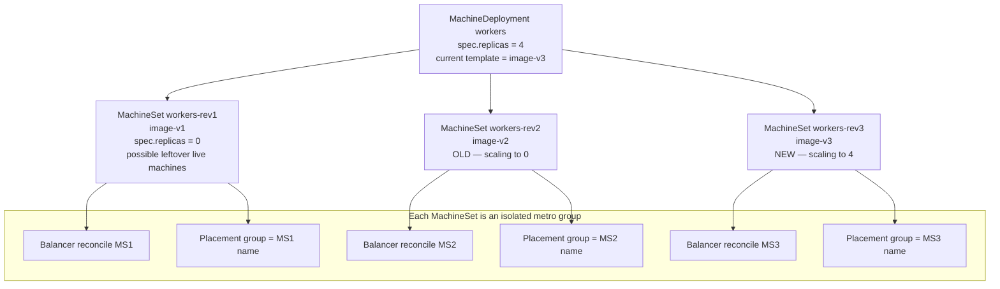

CAPX never adds MachineSets together and rebalances the MD as one pool.

What each set does:

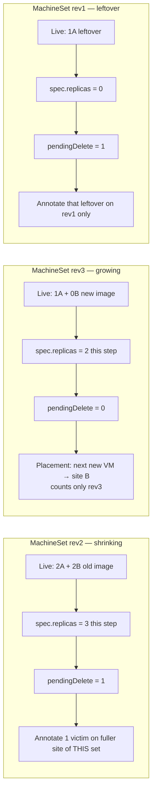

A `delete-machine` annotation on rev2 never selects a rev3 machine. A new VM for rev3 never uses rev2 site counts.

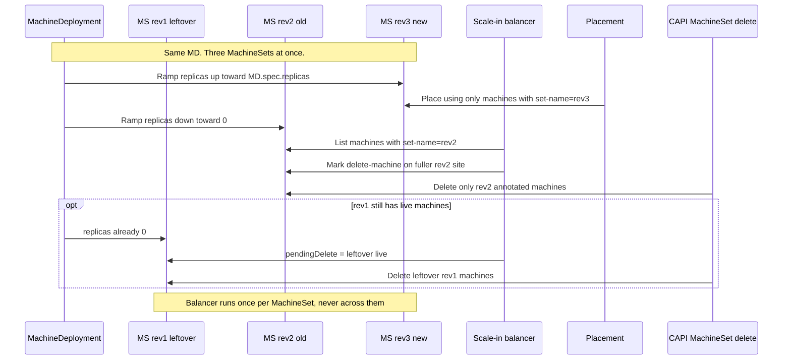

Site counts stay per MachineSet (example: MD desired = 4, sites A/B):

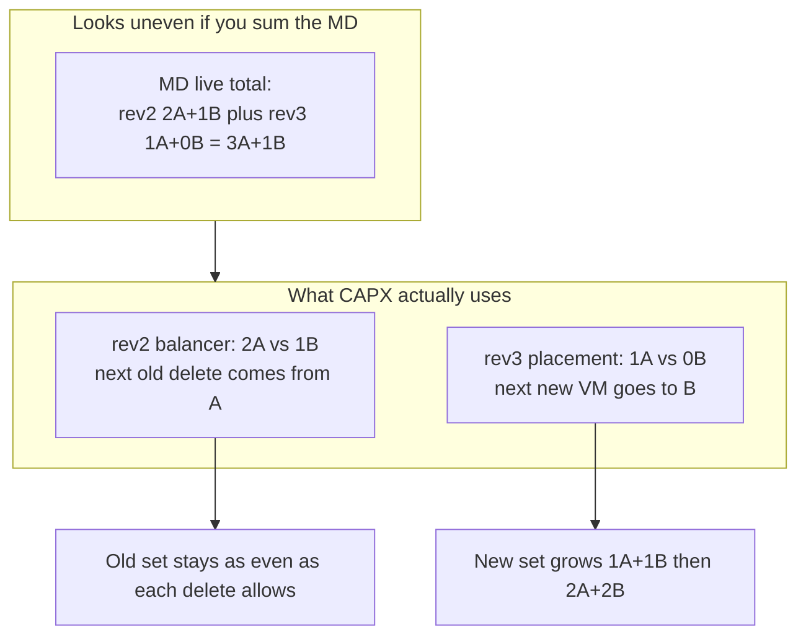

If placement used the MD sum (`3A+1B`), the next new VM would mix generations. It does not.

---

## Scale-in operator: one reconcile

Each reconcile is **one MachineSet**. It never lists the whole MD.

| | MachineSets this reconcile | Live VMs this reconcile |
| --- | --- | --- |
| Scale-in / steady on that set | **1** | That set’s live count only (`spec.replicas` vs live) |

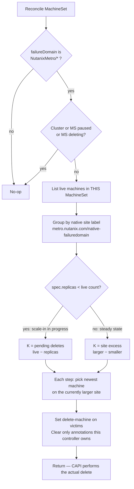

Watch / enqueue:

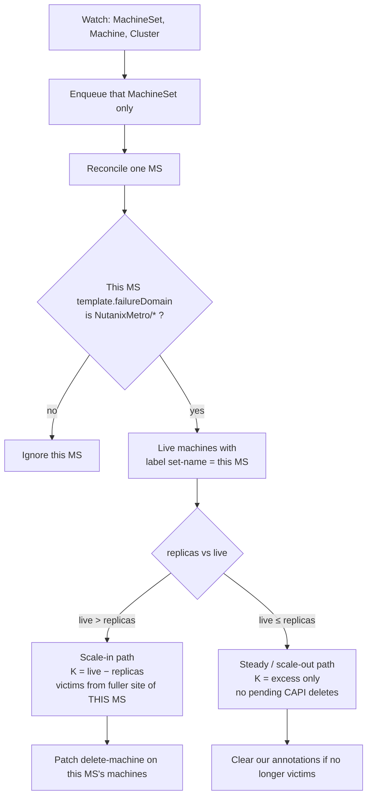

Machines without a native-site label yet are skipped for counting (`ok=false`) and reconsidered once placement records the label.

Known limitation: if `K` is larger than the imbalance, extra victims in **that same batch** fall back to CAPI’s site-blind policy. The next reconcile re-marks. This cannot re-create a full one-sided collapse for normal step-by-step scale-downs.

---

## Placement of new machines

Placement is **not** the scale-in operator. The NutanixMachine controller picks a failure domain by a greedy least-count simulation over siblings in the **same MachineSet**.

| | MachineSets | Live VMs counted for the new VM |
| --- | --- | --- |
| New VM on an existing MS (scale-out) | **1** | Machines already in **that** MS |
| New VM during upgrade (new MS) | **2** in the MD, placement uses **1** (the new MS) | Only the new MS (starts 0, grows) |

`MachineSet` is preferred over `MachineDeployment` so a surge-first rolling upgrade does not skew the new generation (old machines still up would make MD-level counts look balanced and ties would keep hitting the first FD, e.g. 3–1).

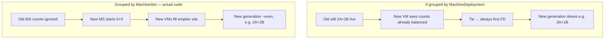

Concurrent creates are intended to be safe: NutanixMachine objects exist before reconcile, siblings are listed with `APIReader`, pending names are sorted, and every reconciler runs the same simulation so each machine gets a distinct slot. Terminating machines are skipped so in-flight deletes free a slot.

---

## Rolling upgrade (two MachineSets)

A worker Kubernetes / image upgrade is a MachineDeployment rolling update: **new MachineSet grows, old MachineSet shrinks to 0**.

| | MachineSets | Live VMs (N = 4, image only) |
| --- | --- | --- |
| Before | **1** | **4** |
| During, default surge | **2** | **4 or 5** |
| During, scale-in strategy | **2** | **3 or 4** |
| After | **1** with VMs | **4** |

| Strategy | Scale during upgrade | What the balancer sees |
| --- | --- | --- |
| Default rolling (`maxSurge=1`, `maxUnavailable=0`) | Create one new machine, then delete one old | Old MS: `replicas < live` → pending scale-in. New MS: scaling up |
| Scale-in (`maxSurge=0`, `maxUnavailable=1`) | Delete first, then create | Old MS shrinks first; new MS grows as slots free |

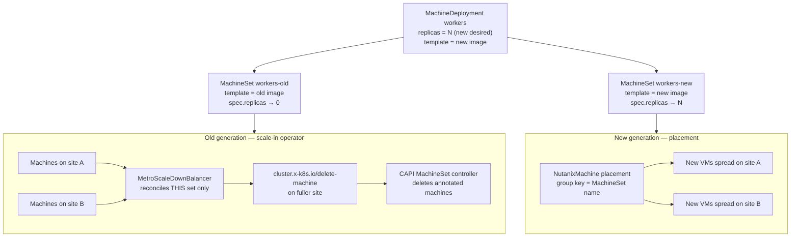

Default surge timeline (example: 4 workers, 2+2, image change only):

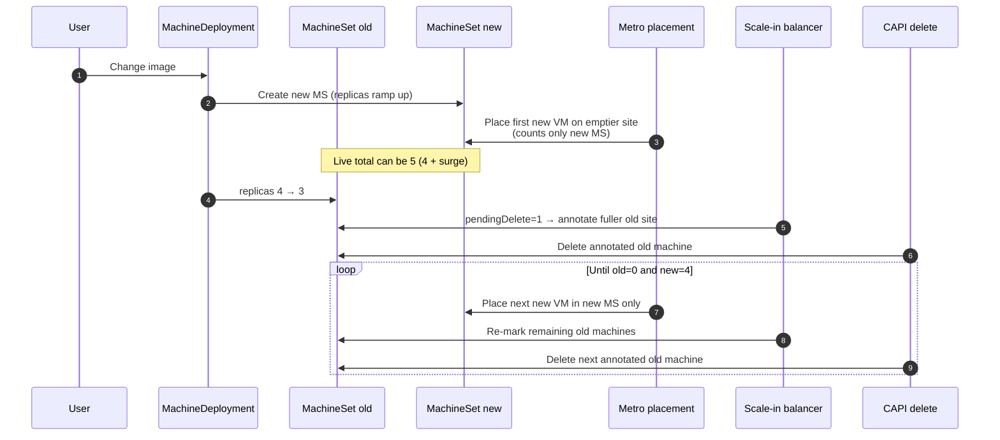

The operator is **not** disabled for the upgrade. It does **not** special-case upgrade vs scale-down. A paused Cluster/MachineSet is a no-op.

When the old MachineSet is gone and the new one is balanced, the balancer clears its own annotations. Steady state is unmarked machines.

---

## Image and replica count changed together

CAPI treats that as **one rolling update** to a new MachineSet whose **target size is the new replica count**. It is not “roll the image, then scale.”

| | MachineSets | Live VMs |
| --- | --- | --- |
| Before (example start 6) | **1** | **6** |
| During, image + scale-up 4→6 | **2** | **4** up to **6 or 7**; new MS target **6** |
| During, image + scale-down 6→4 | **2** | **6** down to **4 or 5**; new MS target **4** |
| After scale-up | **1** | **6** |
| After scale-down | **1** | **4** |

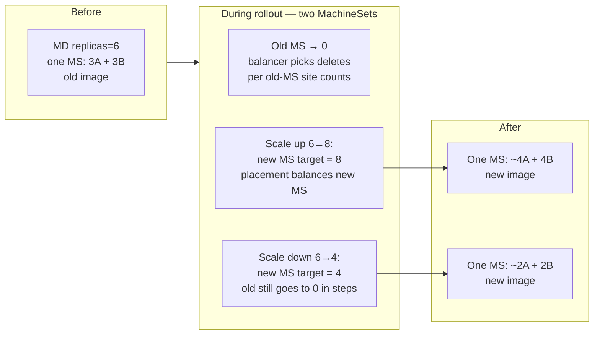

| MachineSet | Image + scale **up** (4→6) | Image + scale **down** (6→4) |
| --- | --- | --- |
| **Old** | Still shrinks to 0. Balancer marks victims on the fuller **old** site | Same: old set still goes to 0 |
| **New** | Grows toward 6. Placement balances the **new** set only | Grows toward 4. Not mixed with old |

Scale-down + image, default surge (`maxUnavailable=0` keeps at least the new desired count available):

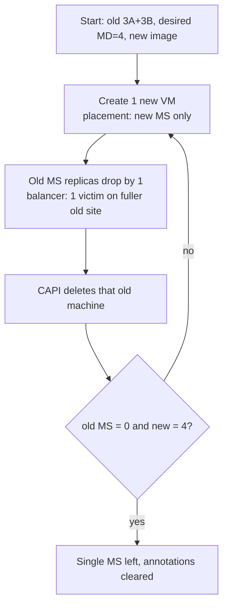

CAPI does **not** dump all old machines in one shot when `maxUnavailable=0`. Each old-MS step usually has `pendingDelete` of 1. If `maxUnavailable` is large, many old replicas can drop in one update; extra victims after balance in that batch are site-blind until the next reconcile.

---

## How many MachineSets and VMs

All counts below are for **one worker `MachineDeployment`**. They are not cluster-wide (control plane is a separate owner). “Live VMs” means Machines in that MD that are not already deleting.

**MachineSet objects vs live generations**

CAPI keeps **one MachineSet per template revision**. After a rollout finishes, `revisionHistoryLimit` (CAPI default **1**) can leave an extra MachineSet with `spec.replicas = 0` and **0 live VMs**. `kubectl get machinesets` may show 2 objects in “steady state”; only **one** of them has VMs. CAPX balances each object separately; an empty leftover is a no-op.

Unless noted, strategy is CAPI default **`maxSurge=1`, `maxUnavailable=0`**. Then:

- Max machines CAPI will *intend* at once: `MD.spec.replicas + 1`
- Min it tries to keep available: `MD.spec.replicas`

Worked numbers use **N = 4** workers (even split 2A+2B when balanced) unless the case is a replica change.

| Case | MachineSets **with live VMs** | MachineSet **objects** (typical) | Live VMs |
| --- | --- | --- | --- |
| Steady, one template | **1** | 1, or 2 if an old revision is still kept at 0 replicas | **N** (example **4**) |
| Pure scale-out, same image (4→6) | **1** (same MS, replicas raised) | 1 | **4 → 6** (creates on that MS) |
| Pure scale-in, same image (6→4) | **1** | 1 | **6 → 4**. `spec.replicas` often jumps to 4 in one patch; live lags until CAPI deletes. `pendingDelete` can be **2** |
| Image / k8s upgrade only (N stays 4) | **2** during, **1** after | 2 during; 1–2 after (history) | **4 or 5** each step (4 + one surge VM), then **4** |
| Scale-in strategy (`maxSurge=0`, `maxUnavailable=1`), image only | **2** during, **1** after | 2 during; 1–2 after | **3 or 4** each step (delete first), then **4** |
| Image **and** scale-up (4→6) | **2** during, **1** after | 2 during; 1–2 after | From **4** up toward **6 or 7** (`desired + surge`). New MS target is **6**, not 4 |
| Image **and** scale-down (6→4) | **2** during, **1** after | 2 during; 1–2 after | From **6** down toward **4 or 5**. New MS target is **4**. Old still goes to 0 |
| Leftover revision still has a VM | **3** (leftover + old + new) | 3+ | About **N or N+1**, **plus** leftover live machines until they delete |
| Control-plane (KCP) | n/a for this operator | KCP’s own MachineSets | Not counted here |

### Steady state

```text
MachineSets with VMs: 1
Live VMs:             4     (MD.spec.replicas)
```

### Pure scale (no template change) — still one MachineSet

CAPI does **not** create a second MachineSet. It patches the existing one.

```text
4 → 6:  1 MS,  live 4 then 5 then 6
6 → 4:  1 MS,  spec 6→4 at once, live 6 then 5 then 4  (or 6→4 if both deletes land together)
```

### Image-only upgrade — two MachineSets until old is empty

Default surge (`maxSurge=1`). New MS grows to **4**, old MS shrinks to **0**. Live total is **5** while the extra surge VM exists, **4** after each old delete.

```text
Step   MachineSets   Old spec   New spec   Live VMs (if Ready)
0      1             4          —          4
1      2             4          1          5
2      2             3          1          4
3      2             3          2          5
4      2             2          2          4
5      2             2          3          5
6      2             1          3          4
7      2             1          4          5
8      2             0          4          4
done   1 (or 2 objs) 0 or gone  4          4
```

Scale-in strategy (`maxSurge=0`, `maxUnavailable=1`): still **2** MachineSets during the rollout; live VMs are **3** after a delete and **4** after the replacement create.

### Image and replica count together — still two MachineSets; new MS size is the **new** N

Not “roll at 4 then scale.” The new MachineSet’s target is the new `MD.spec.replicas`.

**4 → 6 + new image** (`maxTotal = 6+1 = 7`):

```text
During:  2 MachineSets (old → 0, new → 6)
Live:    starts at 4; CAPI may raise the new MS by more than 1 in one
         reconcile because there is room under 7. Peaks at 6 or 7.
After:   1 MachineSet with 6 VMs
```

**6 → 4 + new image** (`maxTotal = 4+1 = 5`):

```text
During:  2 MachineSets (old → 0, new → 4)
Live:    starts at 6 (above maxTotal), so old must shrink first;
         then live sits around 4 or 5 until new = 4 and old = 0.
After:   1 MachineSet with 4 VMs
```

Old `spec.replicas` can drop by **more than 1** in one MachineDeployment reconcile when the MD itself scaled down (see Concerns). That is still **2** MachineSets, not 1.

### Three MachineSets (leftover old revision still has a VM)

This is **not** the normal two-MS upgrade. It is what you see when a **previous** revision was already scaled to `spec.replicas = 0` but **CAPI has not finished deleting its last Machine** (slow drain, PDB, stuck node, Prism VM delete taking time), and a **new** rollout has already started.

How you get there (example: desired always 4):

```text
1. Steady:           1 MS (image-v1), 4 VMs
2. Upgrade v1 → v2:  2 MS. v2 grows to 4, v1 spec → 0
3. Almost done:      v2 has 4 VMs. v1 spec = 0 but 1 VM still live.
                     That v1 VM is the leftover.
                     Live total = 4 (current) + 1 (leftover) = 5
                     MachineSets with live VMs = 2
4. Another upgrade v2 → v3 starts before that leftover VM is gone:
                     3 MachineSets with live VMs
                     leftover v1: spec 0, live 1
                     old v2:      shrinking toward 0
                     new v3:      growing toward 4
                     Live total ≈ 4 or 5 (v2+v3 surge)  +  1 leftover
```

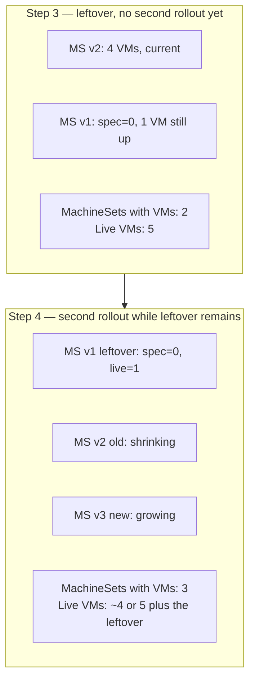

What CAPX does: it still reconciles **each MachineSet alone**. The leftover set has `pendingDelete = live − 0`, so the balancer only annotates that leftover VM. It does **not** count that VM when placing v3 or when picking v2 deletes. CAPI is already trying to delete it; the leftover is extra capacity, not part of `MD.spec.replicas`.

When the leftover Machine finally gets `deletionTimestamp` and is removed, you drop back to the normal **2** MachineSets of the current rollout (or **1** if that rollout already finished).

**No extra VMs remain at the end.** The leftover is temporary. CAPI already set that MachineSet to 0 replicas; once the last Machine and Prism VM are gone, live workers = `MD.spec.replicas` on the current MachineSet. Surge VMs during a rollout are also temporary (`N` or `N+1`, then back to `N`).

An empty leftover object (`spec=0` and **0** live VMs) is only `revisionHistoryLimit` bookkeeping. That is **not** this case.

```text
MS leftover  spec=0, live=1     (this case)
MS old       spec shrinking, live catching up
MS new       spec growing toward N
Live VMs     ≈ N or N+1  + leftover live
MachineSets  3 with a leftover VM; 2 if leftover is already empty
```

CAPX never sums these into one pool. Deletes on leftover or old cannot pick a new-MS VM.

### What “in the end” is

For every case above, when the MD is Available and revisions have drained:

- **1** MachineSet with live VMs (plus at most `revisionHistoryLimit` empty old MachineSets)
- **MD.spec.replicas** live worker VMs — **not** N+leftover, **not** N+surge. Leftover and surge VMs are gone.

---

## How draining happens

CAPX does **not** drain nodes. The metro balancer only sets `cluster.x-k8s.io/delete-machine`. “Drain the fuller site” in that controller means **which VM CAPI should delete first**, not kubelet drain.

Node drain is **CAPI’s Machine controller**, after CAPI has already decided to delete that Machine.

```mermaid
sequenceDiagram
  participant Bal as CAPX metro balancer
  participant MS as CAPI MachineSet
  participant M as CAPI Machine
  participant Drain as CAPI Machine controller
  participant WL as Workload cluster
  participant NM as CAPX NutanixMachine
  participant PC as Prism Central

  Note over Bal,MS: Only when this MachineSet has live > spec.replicas
  Bal->>M: Annotate delete-machine on fuller-site victim
  MS->>M: DELETE Machine (deletionTimestamp)
  Drain->>Drain: Wait for pre-drain hooks if any
  Drain->>WL: Cordon Node
  Drain->>WL: Evict pods (PDBs, MachineDrainRules)
  Note over Drain,WL: Requeue ~20s until pods gone or NodeDrainTimeout
  Drain->>WL: Wait for volume detach
  Drain->>Drain: Wait for pre-terminate hooks if any
  Drain->>NM: Delete NutanixMachine
  NM->>PC: Delete VM (after VG detach if needed)
  Drain->>WL: Delete Node object
  Note over M: Machine finalizers drop; object gone
```

Step by step:

1. **Pick the victim** — MachineSet `spec.replicas` is below live count. CAPI’s MachineSet controller calls `Delete` on N machines. Priority: already-deleting, then `delete-machine` (what CAPX set), then in-place-updating, then unhealthy, then Newest/Random. CAPX is not in this loop.

2. **Machine gets `deletionTimestamp`** — From here the metro balancer **skips** that Machine (it is not live). The leftover case is a Machine that is still in this pipeline.

3. **Pre-drain hooks** — If the Machine has annotations under `pre-drain.delete.hook.machine.cluster.x-k8s.io/`, CAPI waits until those annotations are removed. CAPX does not set these.

4. **Cordon + drain** — Unless `cluster.x-k8s.io/exclude-node-draining` is set or `nodeDrainTimeout` has expired, CAPI cordons the workload Node and evicts pods (same idea as `kubectl drain`). Evictions honor PodDisruptionBudgets and CAPI `MachineDrainRules`. Incomplete drain requeues about every **20s**. Unreachable kubelet uses a short grace period and skips old terminating pods.

5. **Volume detach** — After drain, CAPI waits until the Node has no attached volumes (unless excluded or timeout). Then **pre-terminate** hooks, if any.

6. **Delete the VM** — CAPI deletes the `NutanixMachine`. CAPX `reconcileDelete` waits for in-progress Prism tasks, detaches volume groups if needed, then `VMs.DeleteAsync`. It requeues until the VM is gone, then drops its finalizer.

7. **Delete the Node, then the Machine** — Only after infra is gone does CAPI delete the Kubernetes Node and release the Machine object.

That is why a leftover revision can still show a VM: `spec.replicas` is already 0, but drain, PDB, volume detach, or Prism delete has not finished. When those complete, the extra VM is gone. No second drain pass from CAPX.

Skip drain: `Machine.spec.deletion.nodeDrainTimeoutSeconds = 0` or the exclude-node-draining annotation. Then CAPI still deletes the Machine and CAPX still deletes the VM; pods are not evicted first.

---

## Races with CAPI

CAPX never deletes machines. The only structural race is **timing**: CAPI can act on `MachineSet.spec.replicas` (create or delete) **before** CAPX has patched `delete-machine` or finished placement. After each CAPI action, CAPX reconciles again.

### Shared race: CAPI is faster than the annotation

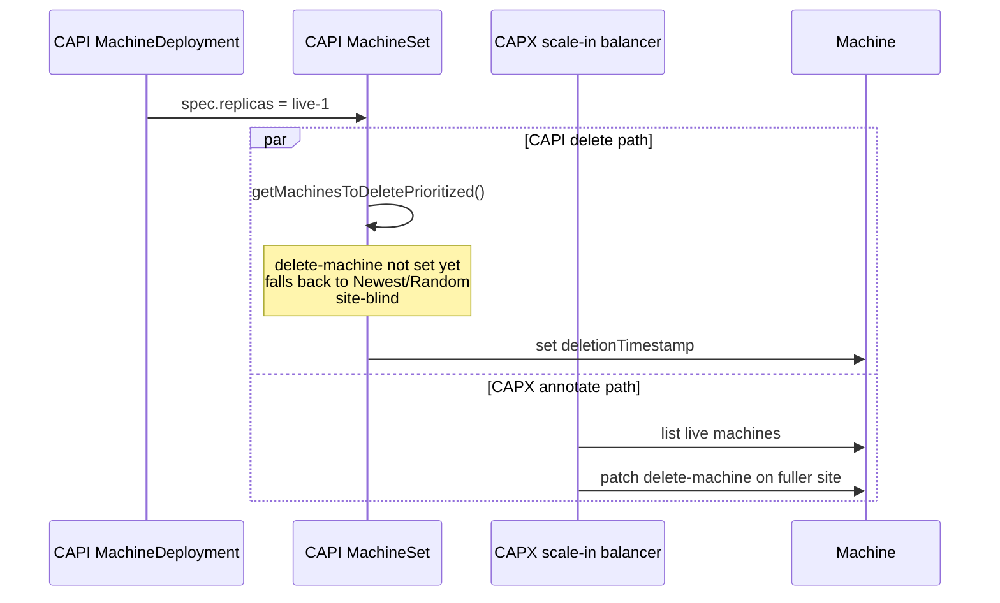

If CAPI wins, that **one step** can delete the “wrong” site. CAPX then re-marks the remainder. Later steps pull back toward even.

### Pure scale-down (one MachineSet)

| Race | What happens | Outcome |
| --- | --- | --- |
| Annotate vs delete | CAPI scales MS down before `delete-machine` exists | That victim can be site-blind. Next reconcile marks the fuller site |
| Large `pendingDelete` in one step | MD/MS drops many replicas at once | Extra victims in the same batch after balance are CAPI-policy |
| Placement label not set yet | Machine has no `metro.nutanix.com/native-failuredomain` | Balancer skips it. CAPI can still delete it. Site counts under-count |
| Informer cache lag | Balancer uses cache, not APIReader | Can mark from a stale live set. Machine watch requeues |
| Patch conflict | CAPI updates Machine status while CAPX patches annotations | Conflict-safe patch retries; else next reconcile |

CAPX does not fight CAPI replica math. It only orders **which** machines those replicas delete.

### Rolling upgrade (two MachineSets)

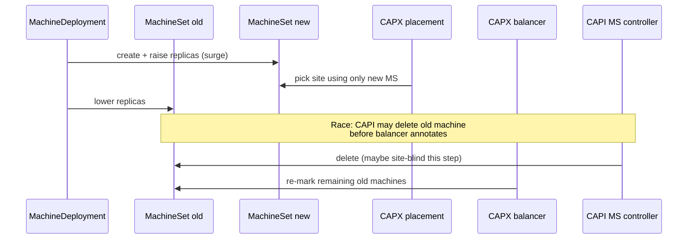

| Race | Scenario | Outcome |
| --- | --- | --- |
| Annotate vs delete on **old** MS | Every scale-in step of the old revision | One old machine may come off the wrong site; new MS is untouched |
| Surge create vs old delete | `maxSurge=1`: create new, then delete old | Placement and balancer use **different MachineSets** — they do not pick the same machine |
| Old machines still Running | If placement used MD, old 2+2 would hide new-MS imbalance | Designed out: group key is MachineSet name |

### Multiple MachineSets for one MD

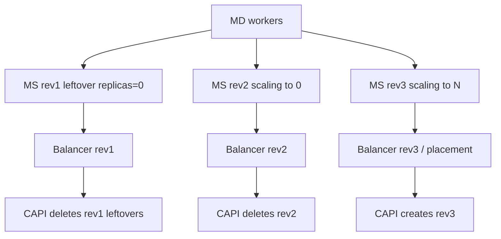

| Race | Scenario | Outcome |
| --- | --- | --- |
| Three CAPI loops in parallel | MD scales rev3 up, rev2 down, rev1 leftovers to 0 | Three independent annotate-vs-delete races. A bad delete on rev2 cannot take a rev3 VM |
| Leftover revision `replicas=0` with 1 live machine | `pendingDelete = leftover` | CAPI may delete before annotation; only one machine |

### Image and replicas together

**Scale-up + new image (4→8)**

| Race | Outcome |
| --- | --- |
| Many creates on the new MS | Concurrent NutanixMachine reconciles. Mitigated by same sibling list + name sort + APIReader. Residual: a machine listed before its sibling exists can double-pick a site; later unplaced machines fill the hole |
| Old MS still deleting | Isolated by MachineSet. Worst case: one-sided delete for one old-MS step |

**Scale-down + new image (6→4)**

| Race | Outcome |
| --- | --- |
| Annotate vs delete on old MS | Same as upgrade |
| Large `maxUnavailable` | Several old replicas drop in one MS spec update → extra victims after balance are site-blind **for that batch** |

### Placement vs CAPI create

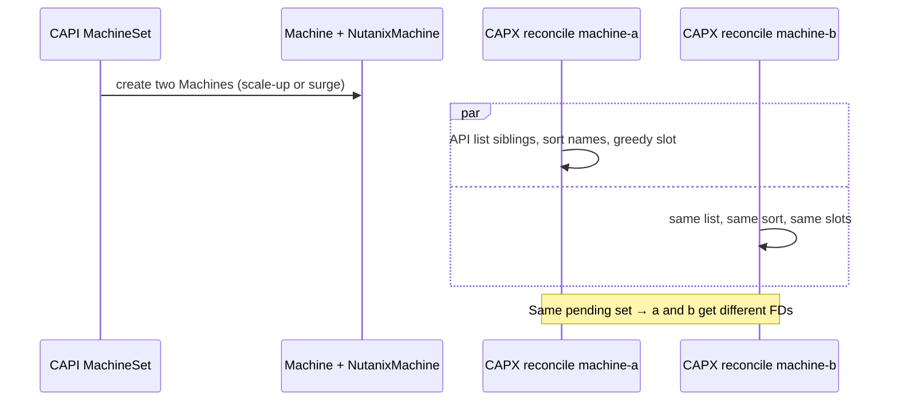

| Race | Scenario | Outcome |
| --- | --- | --- |
| Sibling not in API yet | machine-a reconciles before machine-b exists | Both may pick site A. Next unplaced machine goes to B |
| Delete in flight, label still present | Terminating NutanixMachine not skipped yet | New VM may avoid a site that is about to free; then self-heal |

Placement never sets `delete-machine`.

### Other scenarios

| Scenario | Race with CAPI |
| --- | --- |
| Cluster paused mid-rollout | Balancer no-ops. If Cluster is paused, CAPI MD/MS should pause too |
| Operator already set `delete-machine` | CAPX never clears it. CAPI deletes that machine first (operator intent can fight balance) |
| MachineHealthCheck / remediation | CAPI can delete without an MS replica change. Balancer does not choose the victim. Next scale-in re-marks from the new counts |
| Cluster autoscaler | Scale-up: sibling placement race. Scale-down: same annotate-vs-delete, often 1 replica at a time |
| Control-plane upgrade | This operator does **not** run. KCP scale-in is CAPI-only |

### What is not a race

- CAPX and CAPI choosing which MachineSet shrinks — MD owns replica math
- Two MachineSets stealing each other’s victims — deletes are per MachineSet
- CAPX rolling back a CAPI deletion — once `deletionTimestamp` is set, the balancer skips that machine

### Practical severity

| How often CAPI wins annotate-vs-delete | Typical impact |
| --- | --- |
| Default `maxUnavailable=0`, `maxSurge=1` (1 delete per step) | At most **one** wrong-site delete per step; next step corrects |
| Big replica drop or high `maxUnavailable` | One batch can unbalance more; later batches correct |
| First machines in a new MS | Placement off-by-one if creates are staggered; later machines fill the hole |

---

## Summary

| Question | Answer |
| --- | --- |
| How many MachineSets can one MD have? | One per revision; **1** in steady/pure scale; **2** during a rollout; **3+** if an older revision still has machines. See [How many MachineSets and VMs](#how-many-machinesets-and-vms) |
| How many live VMs in the end? | Always **MD.spec.replicas** on the current MachineSet. During default surge: **N or N+1**. Pure scale-in: live lags the new spec on the **same** MS |
| Does the scale-in operator merge them? | No |
| Can an old MS delete a new-MS machine? | No |
| Do new VMs balance against old VMs still up? | No — placement key is MachineSet name |
| Does changing image and replicas together disable the balancer? | No. Old set scales to 0 toward the new size; new set is born targeting that size |
| Main race with CAPI? | MachineSet controller can delete (site-blind) before `delete-machine` is visible |
| When is there one MS again? | After older revisions have 0 live machines and are removed |

---

## Concerns

The design is a **bias**, not a lock. CAPI still creates and deletes machines. These are the real operational concerns.

**1. CAPI can delete before CAPX annotates (main one)**  
If the MachineSet controller runs first, that step is site-blind. Default `maxSurge=1` / `maxUnavailable=0` usually means **one** wrong-site delete, then the next step corrects. It is not a deadlock, but you can be 3–1 for a while.

**2. Big replica drop in one shot**  
High `maxUnavailable`, or image+replicas down together with a large step, marks extra victims with CAPI’s policy after sites are even. One batch can unbalance more than a 1-by-1 rollout.

**3. Machines with no native-site label yet**  
The balancer skips them. CAPI can still delete them. Early in create/placement, counts are wrong for that pass.

**4. New MachineSet create stagger**  
If the second new machine is not in the API yet, two VMs can land on the same site. Later machines fill the hole. Off-by-one on the new generation, not a collapse.

**5. Operator / MHC / autoscaler**  
Manual `delete-machine`, MachineHealthCheck, and remediation deletes ignore the balancer. Those can unbalance until the **next** scale-in.

**6. Control plane is out of scope**  
KCP scale-in on metro is **not** protected by this operator.

**7. Informer cache**  
The balancer lists from the informer cache (not APIReader). Stale lists can mark the wrong set for one reconcile; watches usually fix it. Placement already uses APIReader for that reason.

**8. Pause split-brain (rare)**  
If CAPI is not paused and CAPX is, deletes go site-blind with no annotations.

**Not a concern:** mixing old and new MachineSets, or new VMs being placed using old VMs still up. That is explicitly isolated by MachineSet name.

**If you want to harden later:** keep `maxUnavailable=0` on metro worker MachineDeployments, avoid huge replica drops in one patch, and treat MHC victims as known imbalance until the next scale-in.
